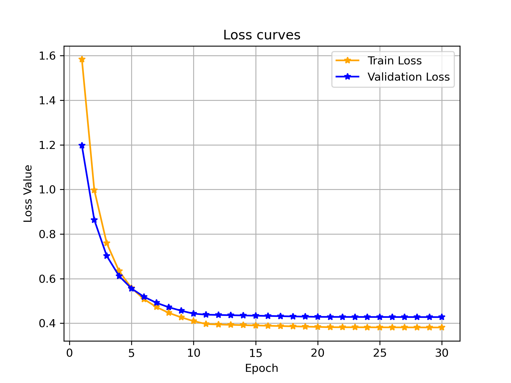
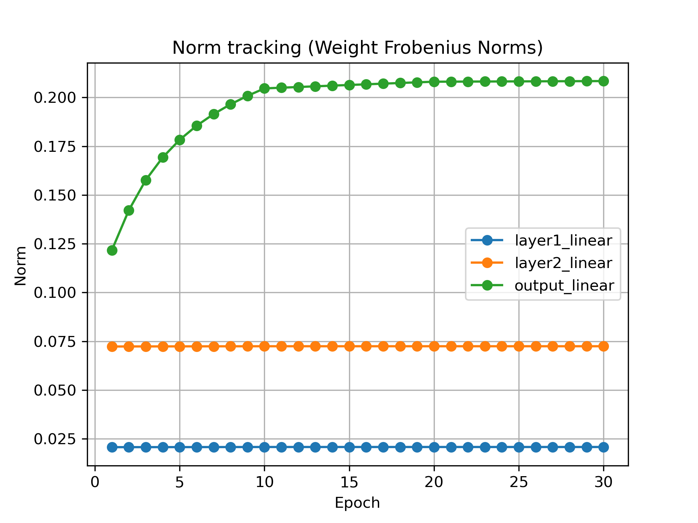
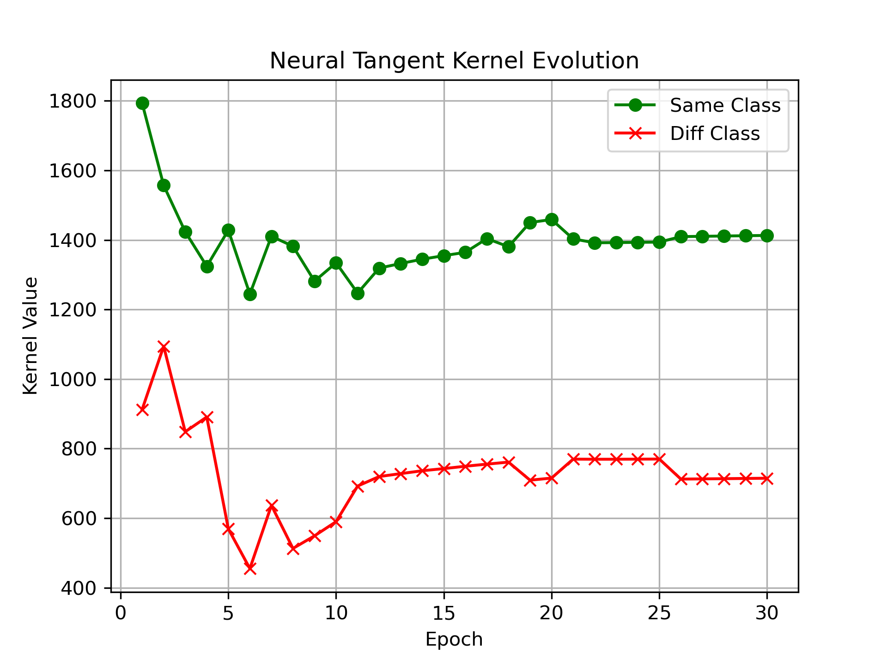
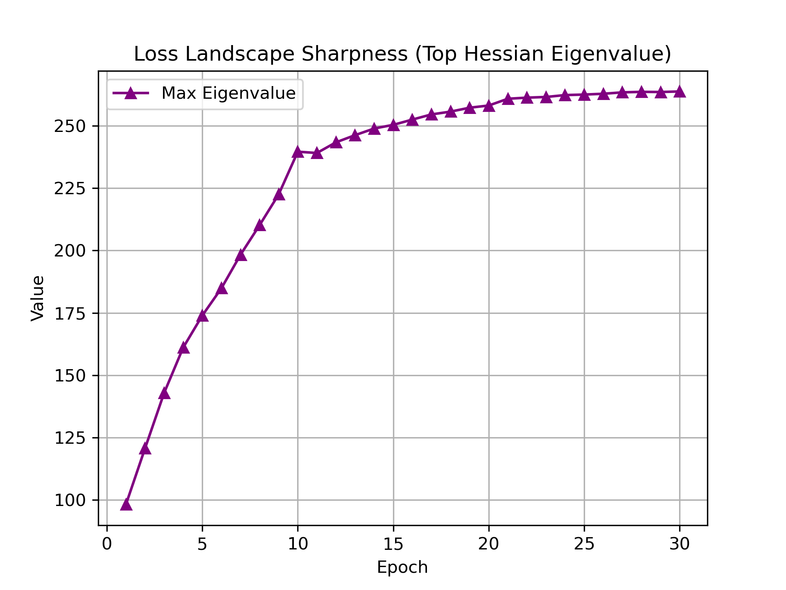

# Peering into the Black Box: Various Perspectives to Neural Network training 

The field of Deep learning tries to model highly complex and non-linear functions to represent data using large and complex neural networks. The field has grown rapidly in popularity in recent years because of the enormous success of various Large Language Models like OpenAI ChatGPT, Google Gemini, Anthropics Claude. The primary benefit of these large language models is their capability to identify and extract rich patterns from the underlying data. 

However this also presents a problem. They are notoriously difficult to understand. They are famously called black boxes, because it is very difficult to see exactly what the network is learning as features and how is information moving through its various layers to arrive at a specific output. In this post, we will try to immplement a set of diagnostic functions to probe the learning mechanics of neural networks from various different perspectives. We will see how much does each layer of the network gets updated using Frobenious norms of their weight matrices, then we will see how the model moves through the parameter landscape to learn how to distinguish between different input samples. Lastly, We will try to visualize the model's motion through the loss landscape to stabalize into a final state. 

## The Diagnostic Pipeline 

The test subject for today is a Multi Layer Perceptron (MLP) trained on the Fashion MNIST dataset. I have choosen the model and dataset for their simplicity and ease of training, but the methods apply to many more kinds of networks. Instead of looking at the loss curve, we will look at metrics that track deeper movements of the weights. Lets get into it !!

```Python 
class MLP(nn.Module): 
    def __init__(self, input_dim = 784, hidden_dim = 128): 
        super().__init__() 

        self.model = nn.Sequential(OrderedDict([
            ('flatten',          nn.Flatten()),
            
            # Block 1 
            ('layer1_linear',    nn.Linear(input_dim, hidden_dim)),
            ('layer1_layernorm',   nn.LayerNorm(hidden_dim)), 
            ('layer1_relu',      nn.ReLU()),
            
            # Block 2
            ('layer2_linear',    nn.Linear(hidden_dim, hidden_dim//2)),
            ('layer2_layernorm',        nn.LayerNorm(hidden_dim//2)),
            ('layer2_relu',      nn.ReLU()),
            
            # Output Layer
            ('output_linear',    nn.Linear(hidden_dim//2, 10))
        ]))

    def forward(self, x): 
        output = self.model(x) 
        return output
```

We first start by looking at the training and validation loss for the model. They are converging very well with the validation loss slightly more than training loss. 



This looks like a normal training run right ? Now lets look at this from a few different perspectives and metrics. 

### 1. Gradient Flow and Weight Matrix Norms

The first metric we track is the scale of the weights across different layers. We are particularly interested in how much each layer changes in each epoch. We expect to see the layers that are closer to the output to update by a large amount. They are lower in the derivative chain and hence they should recieve larger updates. As we move to farther layers, the chain rule causes the updates to decrease and the layer farthest from the inputs should recieve smallest updates. We measure this using the Frobenius norm of the weight matrices. For a given weight matrix $W$ of dimensions $m \times n$, the Frobenius norm is defined mathematically as:

$$||W||_F = \sqrt{\sum_{i=1}^{m} \sum_{j=1}^{n} |W_{i,j}|^2}$$

Frobenius norm tells us the magnitude of the length of the weight matrix. here is the code to calculate that for an MLP model.  

```Python
def probe_step_1_weight_norms(self):
    for name, param in self.model.named_parameters():
        if 'linear' in name and 'weight' in name:

            # Frobenius norm
            fro_norm = torch.norm(param.data, p='fro').item()

            # normalize the norm with the number of parameters in each layer
            num_elements = param.data.numel()
            normalized_norm = fro_norm / (num_elements ** 0.5)
            
            self.weight_norms[name.split(".")[1]].append(normalized_norm)

```
Below is the plot of the three layers of the MLP



In the plot we see that the layer closes to the output layer recieve large updates and those further away recieve smaller updates. You can clearly see the differential growth rates between the initial feature-extraction layers and the final classification layer. Over time, all 3 layers stabalize and further training does not change the magnitude of weights. 

### 2. Empirical Neural Tangent Kernel (NTK) Evolution

The Neural Tangent Kernel was first defined for infinite width neural networks. It dictates how the network's predictions on a dataset evolve during training. It tries to measure how changing the weights with respect to one sample change predictions about another sample. If we update the model's weight to make a better classification about a sample of dress, then all the other samples of dress should benefit from that change, while samples of other classes should not have any effect in their classification accuracy. 

Building an infinite width neural network is impossible so we use an approximation called an emperical Neural Tangent Kernel. Given two inputs $x$ and $x'$, and a network $f(x, \theta)$ parameterized by $\theta \in \mathbb{R}^P$, the empirical NTK is the inner product of the gradients of the model's outputs with respect to its parameters is defined as:

$$K(x, x') = \langle \nabla_\theta f(x, \theta), \nabla_\theta f(x', \theta) \rangle$$

We use one more approximation. In a standard multi-class setting, $f(x, \theta)$ outputs a vector of logits. We sum over the output logits so the class level logit information collapses into a single number, we then calculate the NTK on this summed scaler. This heuristic serves as a powerful proxy for the empirical NTK, allowing us to compute kernel alignment efficiently.

We track the NTK between two samples of the same class (two 'Dresses') and two samples of different classes (a 'Dress' and a 'Sneaker'). As training progresses, the network engages in representation learning, and we expect the kernel value for identical classes to diverge from that of different classes.


```Python
def probe_step_2_ntk(self, xA, xB, xC):

    def get_grad_vector(x):
        self.model.zero_grad()
        out = self.model(x)
        # Summing outputs to get scalar for gradient backprop
        out.sum().backward(retain_graph=True)
        
        grads = []
        for p in self.model.parameters():
            if p.grad is not None:
                grads.append(p.grad.view(-1))
        return torch.cat(grads)

    # Compute flat gradient vectors for each sample
    grad_A = get_grad_vector(xA)
    grad_B = get_grad_vector(xB)
    grad_C = get_grad_vector(xC)
    self.model.zero_grad()

    # NTK is the inner product of the gradients
    k_AB = torch.dot(grad_A, grad_B).item()
    k_AC = torch.dot(grad_A, grad_C).item()

    self.ntk_same_class.append(k_AB)
    self.ntk_diff_class.append(k_AC)
```



We can see clearly in the plot that the NTK values for the same class samples stay above those of the different class samples indicating that the model is able to clearly differentiate between the two samples and update the weights accordingly. . 

### 3. Loss Landscape Curvature via the Hessian Spectrum

To understand the stability and generalization capabilities of our model, we must analyze the local geometry of the loss landscape and where exactly our model weights stabalize. The Hessian matrix of the loss function $H = \nabla^2_\theta \mathcal{L}$ tracks the curvature of the loss landscape in the local vicinity of a set of parameter values. It tells us whether the landscape is convex, concave or a saddle point. Since visualizing the Hessian matrix for the full model is incredibly difficult, we can look at its eigen values. The top eigen value of the Hessian matrix will tell us the curvature in the steepest direction of the loss landscape. A high dominant eigenvalue ($\lambda_{max}$) indicates a sharp minimum, while a smaller $\lambda_{max}$ suggests a less curved region. More importantly we are interested in looking at the change in the eigen value over epochs, if the model is in a good region of the loss landscape, it should make small incremental changes and thus the eigen value should change smoothly, if he terrain is rough, the eigen value will keep bouncing between high and low values. 

Again, to save computation and storage space, we do not calculate the entire Hessian matrix, instead we use a couple of mathematical tricks to calculate the eigen values of the Hessian matrix, we utilize Pearlmutter's Trick which takes the gradient of gradient to approximate the hessian. After that we combine it with the Power Iteration which takes a dot product of the resultant matrix with a constant vector to approximate the eigen vector. We calculate the Hessian-vector product $H v$ without ever materializing $H$, utilizing the identity:

$$Hv = \nabla_\theta \langle \nabla_\theta \mathcal{L}, v \rangle$$

By iteratively applying this formulation and normalizing the resulting vector:

$$v_{k+1} = \frac{H v_k}{||H v_k||_2}$$

The magnitude $||H v_k||_2$ rapidly converges to $\lambda_{max}$.

```Python
    def probe_step_3_hessian(self, criterion, batch, num_steps=10):
        
        inputs, targets = batch
        
        outputs = self.model(inputs)
        loss = criterion(outputs, targets)
        
        params = [p for p in self.model.parameters() if p.requires_grad]
        grads = torch.autograd.grad(loss, params, create_graph=True)
        
        # Initialize a random vector v with the same shape as parameters
        v = [torch.randn_like(p) for p in params]

        # Normalize v
        v_norm = torch.sqrt(sum(torch.sum(vi ** 2) for vi in v))
        v = [vi / v_norm for vi in v]
        
        # Power iteration loop to find the dominant eigenvector/eigenvalue
        for _ in range(num_steps):
            grad_v_prod = sum(torch.sum(g * vi) for g, vi in zip(grads, v))
            Hv = torch.autograd.grad(grad_v_prod, params, retain_graph=True)
            
            v_norm = torch.sqrt(sum(torch.sum(hvi ** 2) for hvi in Hv))
            if v_norm == 0:
                break
            
            v = [hvi / v_norm for hvi in Hv]
            
        top_eigenvalue = v_norm.item()
        self.hessian_top_eigenvalues.append(top_eigenvalue)

        del grads, loss, outputs

        return 
``` 

 

We can see in the plot that the eigen value climbs smoothely to about 260 and then stabalize around that number. This suggests that the model is able to land in a smooth region of the loss landscape and it is avoiding the jagged slopes and mountains. 


## Conclusion
Training neural networks is far more complex than simple curve fitting. By implementing programmatic probes that track weight norms, NTK values, and Hessian eigenvalues, we transform deep learning from alchemy into rigorous science. 

* **Weight Norms** reveal structural bottlenecks, showing you precisely which layers are absorbing the majority of representation learning and whether your network is suffering from vanishing or exploding updates internally.

* **Empirical NTK Tracking** provides a real-time window into feature geometric separation, proving mathematically whether a network is actually mapping distinct classes to distinct regions in parameter-gradient space long before validation accuracy peaks.

* **Hessian Spectral Analysis** offers a powerful predictive health check for generalization. A rapidly spiking maximum eigenvalue alerts you to sharp, unstable minima that are prone to overfitting, while a smooth, stabilizing trajectory confirms the model has found a robust, flat valley

Through these probes, we have seen the asymmetry of learning across various layers of the network. We also saw how the weight update affects various samples from different classes. Lastly we get to see how the model navigates the loss landscape and how it manages to settle into a good minimum.

Thats all for this post, see you in the next one. Happy coding :)


### References & Further Reading
1. **Glorot, X., & Bengio, Y. (2010).** Understanding the difficulty of training deep feedforward neural networks. *Proceedings of the Thirteenth International Conference on Artificial Intelligence and Statistics (AISTATS)*.
2. **Jacot, A., Gabriel, F., & Hongler, C. (2018).** Neural Tangent Kernel: Convergence and Generalization in Neural Networks. *Advances in Neural Information Processing Systems (NeurIPS)*.
3. **Mohamadi, M. A., Bae, W., & Sutherland, D. J. (2023).** A Fast, Well-Founded Approximation to the Empirical Neural Tangent Kernel. *Proceedings of the 40th International Conference on Machine Learning (ICML)*, PMLR 202:25061-25081.
4. **Pearlmutter, B. A. (1994).** Fast exact multiplication by the Hessian. *Neural Computation*, 6(1), 147-160.
5. **Xiao, H., Rasul, K., & Vollgraf, R. (2017).** Fashion-MNIST: a novel image dataset for benchmarking machine learning algorithms. *arXiv preprint arXiv:1708.07747*.